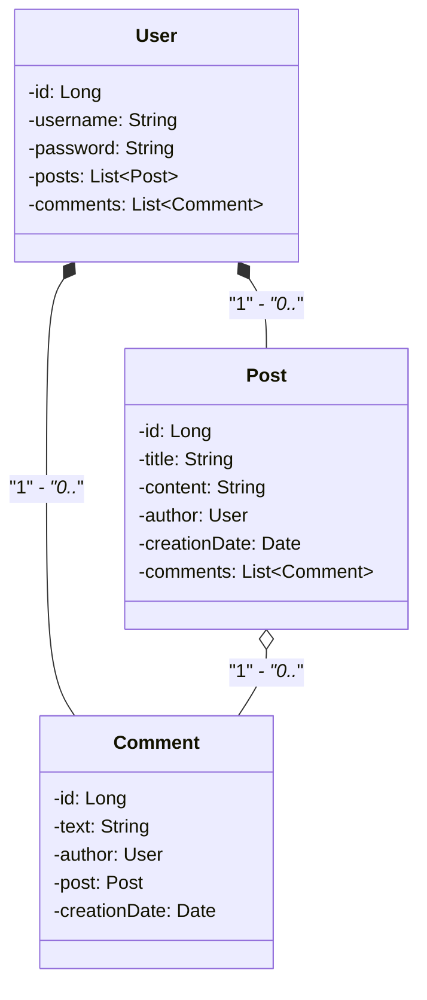

# Blog API Project

## Descrição do Projeto - Blog API

O projeto "Blog API" é uma aplicação Java que fornece uma API para gerenciar um blog online. Ele é projetado para lidar com usuários, postagens e comentários, permitindo interações dinâmicas em um ambiente de blog colaborativo. Abaixo estão as principais entidades e funcionalidades do projeto:

## Entidades Principais

### User (Usuário)

A entidade que representa um usuário do blog.
Possui atributos como id, username, password, posts (postagens criadas pelo usuário) e comments (comentários feitos pelo usuário).

### Post (Postagem)

Representa uma postagem no blog.
Contém atributos como id, title, content, author (autor da postagem), creationDate (data de criação) e comments (comentários na postagem).

### Comment (Comentário)

Representa um comentário feito em uma postagem.
Possui atributos como id, text (texto do comentário), author (autor do comentário), post (postagem à qual o comentário pertence) e creationDate (data de criação).

## Funcionalidades Principais:

### Cadastro de Usuário

Permite o cadastro de novos usuários no sistema, como também atualização dos existentes.

### Criação de Postagem

Usuários podem criar novas postagens, associando-as ao seu perfil e atualiza-las.

### Comentários em Postagens

Facilita a adição de comentários às postagens existentes e sua atualização.

### Recuperação de Dados

Fornece endpoints para recuperar informações sobre usuários, postagens e comentários.

## Relacionamentos

Cada usuário pode criar várias postagens e fazer vários comentários.
Cada postagem pertence a um único usuário e pode ter vários comentários.
Cada comentário é associado a um usuário e a uma postagem específica.

## Tecnologias Utilizadas

Linguagem de Programação: Java.  
Estrutura de Projeto: Classes separadas para entidades (User, Post, Comment).  
Persistência de Dados: JPA, Hibernate.  
Frameworks: Spring Boot.  
Ferramentas: Railway, OpenAPI (Swagger).  
Banco de dados: PostgreSQL.  

# Diagrama de Classes

